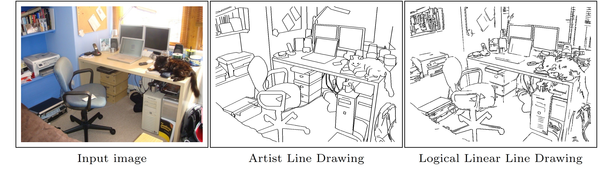
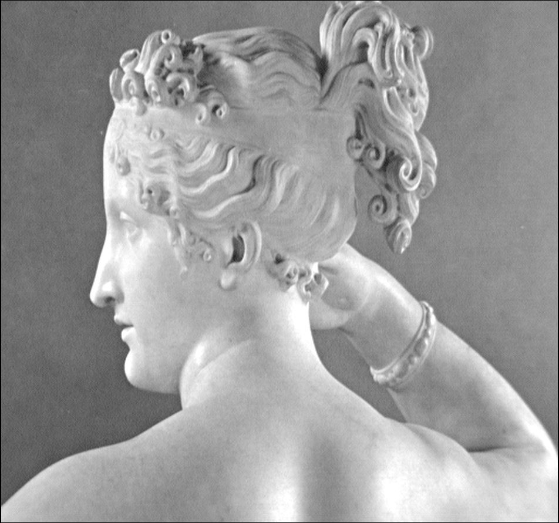
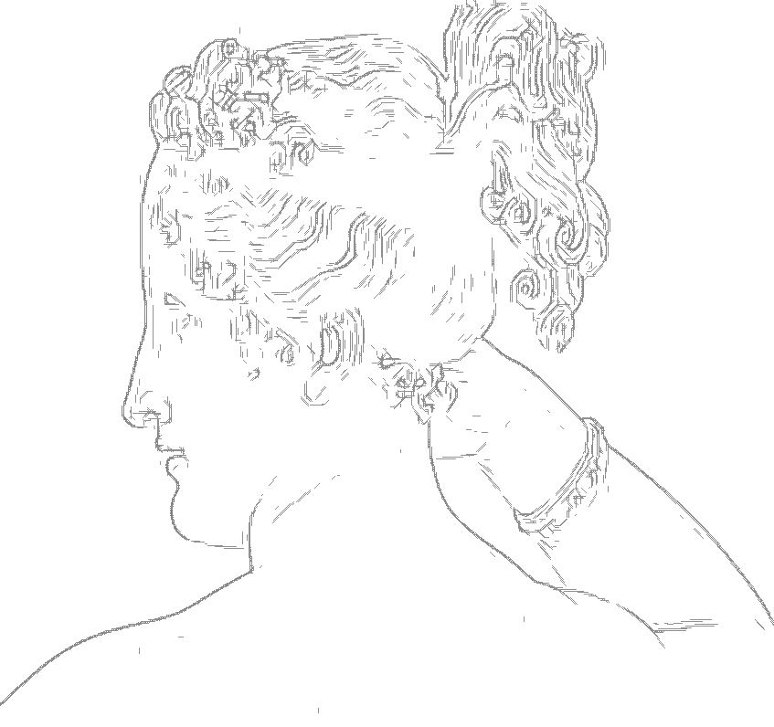

# Machine Generated Logical/Linear Line Drawings

Automatic line drawing extraction from scenes/images using logical/linear operators framework.

This is part of my Ph.D. work and the complete package would be soon uploaded to this git repository (please either check the page again in a couple of weeks or write me an email at: morteza@cim.mcgill.ca). 

Currently, the repository contains a folder named `LogicalLinear`, which represents a complete implementation of the Logical/Linear
image operators defined in the paper "Logical/Linear Operators for Image Curves" by **Lee Iverson and Steven W. Zucker** published in PAMI (also available as ftp://ftp.cim.mcgill.ca/pub/people/leei/loglin/loglin.ps.gz).  The implementation is both fast and general, written in portable C.

The original version of this program works with just `pgm` (portable gray map) input files (which is available here: ftp://ftp.cim.mcgill.ca/pub/people/leei/loglin.tar.gz).  The current version uploaded in this repository (which is a **fork** on the original version), works with most of the standard image formats (`jpg`, `png` and etc.). When compiled, the program pgmloglin receives input files and produces a machine readable PostScript file describing the oriented features in the image.  The program will selectively compute any or all of the edge, bright line and dark line labels in the image.

 

This approach is devised to recover image curves while preserving singularities and junctions. Operators are designed to respond when any of the three conditions of being an Edge (**E**), or a Positive Constrast Line (**P**), or a Negative Constrast Line (**N**) is met locally in an image, and if so, either an edge, or a line is reported.


## Setup

**NOTE** 

THIS CODE IS TESTED WITH MATLAB 2018b and Windows version of MinGW. Earlier version of MATLAB or other operating system or C compilers may not work with this package. 

To download the code, open a terminal and type:
```
https://github.com/mrezanejad/LineDrawingExtraction.git
```
This will create a directory `LineDrawingExtraction/` containing all of the code seen here.
<br>

## Logical Linear Installation
Instructions to install the logical linear package on Windows:

1) Install MinGW (you can get that from here: http://www.mingw.org/). 

2) Add MinGW bin directory (usually this is the path: `C:\MinGW\bin`) to your environment variable path on your system. 

3) Run a command prompt window and cd to `LineDrawingExtraction/LogicalLinear`.

4) For compilation, run the following commands
```
./configure
make
```

5) After this step, you must have a binary (e.g. pgmloglin.exe on Windows), that you can use to create image curves. 

## Usage

Usage:  `[-ENP] [-n<ndirs>] [-d<degree>] [-t<thresh>] [input] [out]`  

Example:

```
pgmloglin.exe -E input.jpg output.ps
```

**E is for Edges 
N is for Negative Contrast Lines 
P is for Positive Contrast Lines**

You can have all three or a subset of them. 

If the package does not compile on mac or linux, you may install wine (https://www.winehq.org/) and easily run the windows binary. You just need to put wine command before. 

```
wine pgmloglin.exe -E input.jpg output.ps  
```

## Example

```
pgmloglin.exe -E  Paolina.pgm result.ps
```
<p align = "center">
  
  </p>


## Updating
Assuming you have not made any local changes to these files, you can update your local code to the newest version with [git pull](https://git-scm.com/docs/git-pull).
Open a terminal, navigate to your `SalienceScoresForScene/` folder, and run
```
git pull
```

If you have edited any files, `git pull` may throw errors. You can update while keeping your local changes by running:
```
git stash
git pull
git stash pop
```

If you are new to git, you can learn more about it [here](https://git-scm.com/doc)
<br>
<br>

## References
If you use the our SalienceScoresForScenes package, we appreciate it if you cite the following papers:

```
@ARTICLE{iverson_llOps, 
author={L. A. {Iverson} and S. W. {Zucker}}, 
journal={IEEE Transactions on Pattern Analysis and Machine Intelligence}, 
title={Logical/linear operators for image curves}, 
year={1995}, 
volume={17}, 
number={10}, 
pages={982-996}, 
keywords={computer vision;edge detection;feature extraction;Boolean functions;image segmentation;logical/linear operators;image curves;image measurement operators;early vision;linear operator theory;Boolean logic;low-order differential structure;linear model;tangential conditions;curvilinear differential structure;line-like features;edge-like features;false-positive responses;edge detection;feature extraction;computer vision;Image edge detection;Computer vision;Gaussian noise;Detectors;Integrated circuit noise;Boolean functions;Ear;Feature extraction;Biological information theory;Machine vision}, 
doi={10.1109/34.464562}, 
ISSN={0162-8828}, 
month={Oct},}

@InProceedings{rezanejad2019scene,
author = {Rezanejad, Morteza and Downs, Gabriel and Wilder, John and Walther, Dirk B and Jepson, Allan and Dickinson, Sven and Siddiqi, Kaleem},
title = {Scene Categorization from Contours: Medial Axis Based Salience Measures},
booktitle = {The IEEE Conference on Computer Vision and Pattern Recognition (CVPR)},
month = {June},
year = {2019}
}
```

## Contact
For any question regarding this package, please contact morteza@cim.mcgill.ca

## License
This program is free software: you can redistribute it and/or modify
it under the terms of the GNU General Public License as published by
the Free Software Foundation, either version 3 of the License, or
(at your option) any later version.

This program is distributed in the hope that it will be useful,
but WITHOUT ANY WARRANTY; without even the implied warranty of
MERCHANTABILITY or FITNESS FOR A PARTICULAR PURPOSE.  See the
GNU General Public License for more details.

You should have received a copy of the GNU General Public License
along with this program.  If not, see <https://www.gnu.org/licenses/>.
